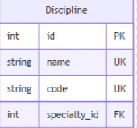

# Вариант №11. Сервис дисциплин (Discipline Service)

## 1. Добавить дисциплину

Информация, требуемая для создания дисциплины:

| Параметр | Обязательность | Тип | Ограничение | Значение по умолчанию |
|---|---|---|---|---|
| name | Обязательно | Строка | не пустое| — |
| code | Обязательно | Строка | формат: буквы, цифры, точки, дефисы, уникальный | — |
| speciality_id | Обязательно | Целое |  | — |

Параметр code уникален глобально (не зависит от специальности). Дисциплина может быть привязана к одной или нескольким специальностям через speciality_id.

Информация, возвращаемая в случае удачного создания дисциплины:

| Параметр | Тип |
|---|---|
| id | Целое |
| name | Строка |
| code | Строка |
| speciality_id | Целое |

## 2. Изменить дисциплину по ID

Информация, требуемая для изменения дисциплины по ID:

| Параметр | Обязательность | Тип | Ограничение | Значение по умолчанию |
|---|---|---|---|---|
| name | Не обязательно | Строка | Уникальное, не пустое | — |
| code | Не обязательно | Строка | Уникальное, формат: буквы, цифры, точки, дефисы | — |
| speciality_id | Не обязательно | Целое | Каждый ID должен существовать в таблице Speciality | — |

При изменении speciality_id старые связи заменяются новыми (сначала удаляются все существующие связи дисциплины со специальностями, затем добавляются новые).

Информация, возвращаемая в случае удачного изменения дисциплины:

| Параметр | Тип |
|---|---|
| id | Целое |
| name | Строка |
| code | Строка |
| speciality_id | Целое |

## 3. Удалить дисциплину по ID

Вернет True, если дисциплина была удалена (вместе со всеми связями в таблице DisciplineSpecialty), иначе вернет False.

## 4. Получить дисциплину по ID

Информация, возвращаемая в случае удачного поиска дисциплины по ID:

| Параметр | Тип |
|---|---|
| id | Целое |
| code | Строка |
| speciality_id | Целое |

## 5. Получить список дисциплин по заданным параметрам

Информация, требуемая для получения списка дисциплин:

| Параметр | Тип | Описание |
|---|---|---|
| name | Строка | Фильтр по названию (поиск по подстроке, регистронезависимый) |
| code | Строка | Фильтр по коду (поиск по подстроке, регистронезависимый) |
| speciality_id | Целое | Фильтр по ID специальности (возвращает все дисциплины, связанные с этой специальностью) |

Информация возвращается в виде списка дисциплин. Каждый элемент списка имеет следующие параметры:

| Параметр | Тип |
|---|---|
| id | Целое |
| name | Строка |
| code | Строка |
| speciality_id | Целое |

## ER-диаграмма
