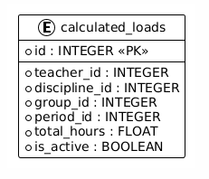

# Load Calculation Service (Сервис расчета нагрузки)

**Вариант 14**

## Сущность: CalculatedLoad

### Добавить CalculatedLoad

Информация требуемая для создания CalculatedLoad:

| Параметр | Пояснение | Обязательность | Тип | Ограничение | Значение по умолчанию |
|----------|-----------|----------------|-----|-------------|-----------------------|
| `teacher_id` | ID преподавателя | Да | int | >0 | — |
| `period_id` | ID учебного периода | Да | int | >0 | — |
| `discipline_id` | ID дисциплины | Да | int | >0 | — |
| `group_id` | ID группы | Да | int | >0 | — |
| `total_hours` | Нагрузка в часах | Нет | float | ≥0 | 0.0 |

**Уникальные комбинации параметров:**
- `teacher_id` + `period_id` + `discipline_id` + `group_id`

Информация возвращаемая в случае удачного создания CalculatedLoad:

| Параметр | Тип |
|----------|-----|
| `id` | int |
| `teacher_id` | int |
| `period_id` | int |
| `discipline_id` | int |
| `group_id` | int |
| `total_hours` | float |

### Изменить CalculatedLoad по ID

Информация требуемая для изменения CalculatedLoad по ID:

| Параметр | Пояснение | Обязательность | Тип | Ограничение |
|----------|-----------|----------------|-----|-------------|
| `total_hours` | Новое значение нагрузки | Нет | float | ≥0 |

**Примечание:** Если параметр `total_hours` не передан, обновление не выполняется, и возвращается текущее состояние записи.

Информация возвращаемая в случае удачного изменения CalculatedLoad:

| Параметр | Тип |
|----------|-----|
| `id` | int |
| `teacher_id` | int |
| `period_id` | int |
| `discipline_id` | int |
| `group_id` | int |
| `total_hours` | float |

### Удалить CalculatedLoad по ID

Вернет `True`, если сущность была закрыта (удалена), иначе вернет `False`. Фактически запись из БД не удаляется, а реализуется через булевое поле `is_active`.

### Получить CalculatedLoad по ID

Информация возвращаемая в случае удачного поиска CalculatedLoad по ID:

| Параметр | Тип |
|----------|-----|
| `id` | int |
| `teacher_id` | int |
| `period_id` | int |
| `discipline_id` | int |
| `group_id` | int |
| `total_hours` | float |

### Получить список CalculatedLoad по заданным параметрам

Информация требуемая для получения списка CalculatedLoad:

| Параметр | Пояснение | Обязательность | Тип | Ограничение | Значение по умолчанию |
|----------|-----------|----------------|-----|-------------|-----------------------|
| `teacher_id` | Фильтр по ID преподавателя | Нет | int | >0 | — |
| `period_id` | Фильтр по ID учебного периода | Нет | int | >0 | — |
| `discipline_id` | Фильтр по ID дисциплины | Нет | int | >0 | — |
| `group_id` | Фильтр по ID группы | Нет | int | >0 | — |
| `limit` | Максимальное количество записей | Нет | int | 1-1000 | 100 |
| `offset` | Количество пропущенных записей | Нет | int | ≥0 | 0 |

Информация возвращаемая в виде списка CalculatedLoad:

| Параметр | Тип |
|----------|-----|
| `id` | int |
| `teacher_id` | int |
| `period_id` | int |
| `discipline_id` | int |
| `group_id` | int |
| `total_hours` | float |

## ER-диаграмма

