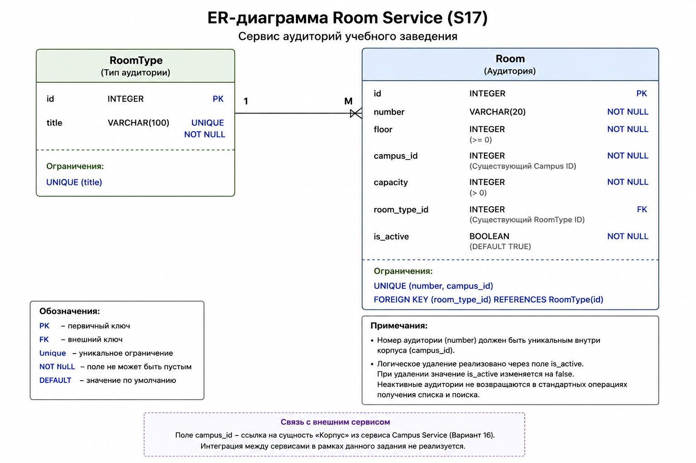

# Вариант №17 — Room Service

**Исполнитель:** Нечаев Артем Дмитриевич  
**Группа:** 24-1П11

---

# Описание сервиса

Room Service — микросервис аудиторий учебного заведения.

Сервис отвечает за:

- хранение информации об аудиториях;
- хранение типов аудиторий;
- получение информации об аудиториях;
- логическое удаление аудиторий.

Примеры типов аудиторий:

- Classroom
- Laboratory
- Workshop

---

# 1. Добавить аудиторию

## Информация требуемая для создания аудитории

Поле `is_active` автоматически устанавливается сервисом.

При создании аудитории параметр `is_active` не передается пользователем и возвращается только в ответе сервиса.

| Параметр | Пояснение | Обязательность | Тип | Ограничение | Значение по умолчанию |
| :--- | :--- | :--- | :--- | :--- | :--- |
| number | Номер аудитории | Да | String | Не пустая строка, максимум 20 символов | — |
| floor | Этаж | Да | Integer | >= 0 | — |
| campus_id | Идентификатор корпуса | Да | Integer | Существующий Campus ID | — |
| capacity | Вместимость аудитории | Да | Integer | > 0 | — |
| room_type_id | Идентификатор типа аудитории | Да | Integer | Существующий RoomType ID | — |

## Уникальные комбинации параметров

- number + campus_id

Номер аудитории должен быть уникальным внутри корпуса.

## Информация возвращаемая в случае удачного создания аудитории

| Параметр | Тип |
| :--- | :--- |
| id | Integer |
| number | String |
| floor | Integer |
| campus_id | Integer |
| capacity | Integer |
| room_type_id | Integer |
| is_active | Boolean |

---

# 2. Изменить аудиторию по ID

## Информация требуемая для изменения аудитории по ID

Поле `is_active` не может быть изменено через операцию редактирования аудитории.

Изменение значения `is_active` выполняется только операцией логического удаления.

| Параметр | Пояснение | Обязательность | Тип | Ограничение |
| :--- | :--- | :--- | :--- | :--- |
| number | Номер аудитории | Нет | String | Не пустая строка, максимум 20 символов |
| floor | Этаж | Нет | Integer | >= 0 |
| campus_id | Идентификатор корпуса | Нет | Integer | Существующий Campus ID |
| capacity | Вместимость аудитории | Нет | Integer | > 0 |
| room_type_id | Идентификатор типа аудитории | Нет | Integer | Существующий RoomType ID |

Если аудитория с указанным идентификатором не существует, сервис возвращает ошибку.

## Информация возвращаемая в случае удачного изменения аудитории

| Параметр | Тип |
| :--- | :--- |
| id | Integer |
| number | String |
| floor | Integer |
| campus_id | Integer |
| capacity | Integer |
| room_type_id | Integer |
| is_active | Boolean |

---

# 3. Удаление аудитории по ID

Удаление аудитории реализуется через логическое удаление.

Физически запись из базы данных не удаляется.

Для логического удаления используется булевое поле:

- is_active

При удалении аудитории значение поля `is_active` изменяется на `false`.

Неактивные аудитории не должны возвращаться в стандартных операциях получения списка и поиска.

## Информация возвращаемая в случае успешного удаления аудитории

| Параметр | Тип |
| :--- | :--- |
| id | Integer |
| number | String |
| floor | Integer |
| campus_id | Integer |
| capacity | Integer |
| room_type_id | Integer |
| is_active | Boolean |

После успешного удаления значение поля `is_active` принимает значение `false`.

---

# 4. Получить аудиторию по ID

## Информация возвращаемая в случае удачного поиска аудитории по ID

| Параметр | Пояснение | Тип |
| :--- | :--- | :--- |
| id | Идентификатор аудитории | Integer |
| number | Номер аудитории | String |
| floor | Этаж | Integer |
| campus_id | Идентификатор корпуса | Integer |
| capacity | Вместимость аудитории | Integer |
| room_type_id | Идентификатор типа аудитории | Integer |
| is_active | Признак активности аудитории | Boolean |

---

# 5. Получить список аудиторий по заданным параметрам

## Информация требуемая для получения списка аудиторий

| Параметр | Пояснение | Тип | Ограничение |
| :--- | :--- | :--- | :--- |
| floor | Фильтр по этажу | Integer | >= 0 |
| campus_id | Фильтр по корпусу | Integer | Существующий Campus ID |
| room_type_id | Фильтр по типу аудитории | Integer | Существующий RoomType ID |
| min_capacity | Минимальная вместимость аудитории | Integer | > 0 |
| max_capacity | Максимальная вместимость аудитории | Integer | > 0 |
| limit | Ограничение количества записей | Integer | от 1 до 100 |

Если параметры фильтрации не указаны, возвращаются только активные аудитории (`is_active = true`).

## Информация возвращаемая в виде списка аудиторий

| Параметр | Тип |
| :--- | :--- |
| id | Integer |
| number | String |
| floor | Integer |
| campus_id | Integer |
| capacity | Integer |
| room_type_id | Integer |
| is_active | Boolean |

---

# 6. Добавить тип аудитории

## Информация требуемая для создания типа аудитории

| Параметр | Пояснение | Обязательность | Тип | Ограничение | Значение по умолчанию |
| :--- | :--- | :--- | :--- | :--- | :--- |
| title | Название типа аудитории | Да | String | Уникальное значение, не пустая строка, максимум 100 символов | — |

## Уникальные комбинации параметров

- title

При попытке создания типа аудитории с уже существующим названием сервис возвращает ошибку.

## Информация возвращаемая в случае удачного создания типа аудитории

| Параметр | Тип |
| :--- | :--- |
| id | Integer |
| title | String |

---

# 7. Получить тип аудитории по ID

## Информация возвращаемая в случае удачного поиска типа аудитории

| Параметр | Пояснение | Тип |
| :--- | :--- | :--- |
| id | Идентификатор типа аудитории | Integer |
| title | Название типа аудитории | String |

---

# 8. Получить список типов аудиторий

## Информация требуемая для получения списка типов аудиторий

| Параметр | Пояснение | Тип |
| :--- | :--- | :--- |
| title | Фильтр по названию типа аудитории | String |
| limit | Ограничение количества записей | Integer |

## Информация возвращаемая в виде списка типов аудиторий

| Параметр | Тип |
| :--- | :--- |
| id | Integer |
| title | String |

Если подходящие записи отсутствуют, возвращается пустой список.

---

# ER-диаграмма

