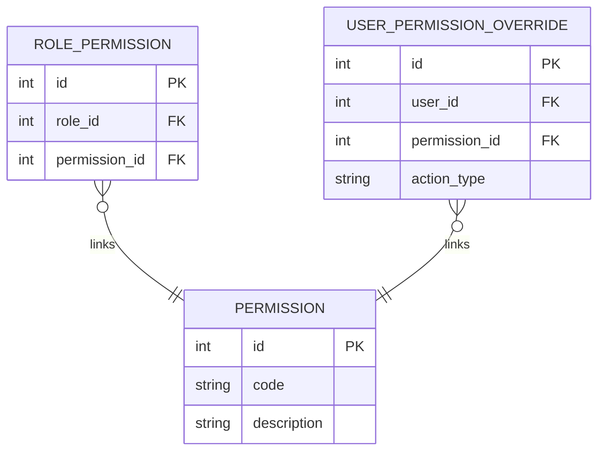

# Вариант №4 — Permission Service (Сервис разрешений)

Микросервис предназначен для тонкой настройки прав доступа в рамках информационной системы колледжа: определение прав на редактирование расписания, просмотр данных и назначение замен.

## ER-диаграмма в 3НФ (Mermaid)

---

## Описание API

### ТАБЛИЦА 1: PERMISSION (Системные разрешения)

#### 1. Добавить сущность
**Информация для создания:**

| Параметр (англ.) | Пояснение | Обязательность | Тип | Ограничение | Значение по умолчанию |
| :--- | :--- | :--- | :--- | :--- | :--- |
| `code` | Уникальный строковый код права | Да | string | макс. 50 симв. | — |
| `description` | Человекочитаемое описание права | Да | string | макс. 255 симв. | — |

*Уникальные комбинации параметров:* `code` (код права не должен повторяться).

**Информация при успешном создании:**

| Параметр (англ.) | Тип |
| :--- | :--- |
| `id` | int |
| `code` | string |

#### 2. Изменить сущность по ID
**Информация для изменения:**

| Параметр (англ.) | Пояснение | Обязательность | Тип | Ограничение |
| :--- | :--- | :--- | :--- | :--- |
| `description` | Новое описание назначения права | Нет | string | макс. 255 симв. |

**Информация при успешном изменении:**

| Параметр (англ.) | Тип |
| :--- | :--- |
| `id` | int |

#### 3. Удалить сущность по ID
Согласно требованиям, Permission Service реализует **жесткое удаление**: запись физически удаляется из БД.
* **Возвращаемое значение:** `true` (если запись найдена и успешно удалена), иначе `false`.

#### 4. Получить сущность по ID
**Возвращаемая информация:**

| Параметр (англ.) | Пояснение | Тип |
| :--- | :--- | :--- |
| `id` | Идентификатор записи | int |
| `code` | Системный код права | string |
| `description` | Описание права | string |

#### 5. Получить список сущностей по заданным параметрам
**Параметры запроса:**

| Параметр (англ.) | Пояснение | Тип |
| :--- | :--- | :--- |
| `code` | Фильтрация по коду права | string |

**Возвращаемый список:**

| Параметр (англ.) | Тип |
| :--- | :--- |
| `id` | int |
| `code` | string |
| `description` | string |

---

### ТАБЛИЦА 2: ROLE_PERMISSION (Связь ролей с правами)

#### 1. Добавить сущность
**Информация для создания:**

| Параметр (англ.) | Пояснение | Обязательность | Тип | Ограничение | Значение по умолчанию |
| :--- | :--- | :--- | :--- | :--- | :--- |
| `role_id` | Идентификатор роли из внешнего сервиса | Да | int | > 0 | — |
| `permission_id` | Идентификатор права из таблицы PERMISSION | Да | int | > 0 | — |

*Уникальные комбинации параметров:* `role_id` + `permission_id` (нельзя привязать одно право к одной роли дважды).

**Информация при успешном создании:**

| Параметр (англ.) | Тип |
| :--- | :--- |
| `id` | int |

#### 2. Изменить сущность по ID
**Информация для изменения:**

| Параметр (англ.) | Пояснение | Обязательность | Тип | Ограничение |
| :--- | :--- | :--- | :--- | :--- |
| `role_id` | Новый идентификатор роли | Нет | int | > 0 |
| `permission_id` | Новый идентификатор права | Нет | int | > 0 |

**Информация при успешном изменении:**

| Параметр (англ.) | Тип |
| :--- | :--- |
| `id` | int |

#### 3. Удалить сущность по ID
Реализует **жесткое удаление** записи.
* **Возвращаемое значение:** `true` (если запись удалена), иначе `false`.

#### 4. Получить сущность по ID
**Возвращаемая информация:**

| Параметр (англ.) | Пояснение | Тип |
| :--- | :--- | :--- |
| `id` | Идентификатор связи | int |
| `role_id` | ID роли | int |
| `permission_id` | ID права | int |

#### 5. Получить список сущностей по заданным параметрам
**Параметры запроса:**

| Параметр (англ.) | Пояснение | Тип |
| :--- | :--- | :--- |
| `role_id` | Фильтр прав для конкретной роли | int |

**Возвращаемый список:**

| Параметр (англ.) | Тип |
| :--- | :--- |
| `id` | int |
| `role_id` | int |
| `permission_id` | int |

---

### ТАБЛИЦА 3: USER_PERMISSION_OVERRIDE (Персональные исключения пользователей)

#### 1. Добавить сущность
**Информация для создания:**

| Параметр (англ.) | Пояснение | Обязательность | Тип | Ограничение | Значение по умолчанию |
| :--- | :--- | :--- | :--- | :--- | :--- |
| `user_id` | Идентификатор пользователя из внешнего сервиса | Да | int | > 0 | — |
| `permission_id` | Идентификатор права из таблицы PERMISSION | Да | int | > 0 | — |
| `action_type` | Тип переопределения | Да | string | "allow" или "deny" | — |

*Уникальные комбинации параметров:* `user_id` + `permission_id` (одно персональное правило на одно право).

**Информация при успешном создании:**

| Параметр (англ.) | Тип |
| :--- | :--- |
| `id` | int |

#### 2. Изменить сущность по ID
**Информация для изменения:**

| Параметр (англ.) | Пояснение | Обязательность | Тип | Ограничение |
| :--- | :--- | :--- | :--- | :--- |
| `action_type` | Изменить тип правила | Нет | string | "allow" или "deny" |

**Информация при успешном изменении:**

| Параметр (англ.) | Тип |
| :--- | :--- |
| `id` | int |

#### 3. Удалить сущность по ID
Реализует **жесткое удаление** записи.
* **Возвращаемое значение:** `true` (если запись удалена), иначе `false`.

#### 4. Получить сущность по ID
**Возвращаемая информация:**

| Параметр (англ.) | Пояснение | Тип |
| :--- | :--- | :--- |
| `id` | ID записи переопределения | int |
| `user_id` | ID пользователя | int |
| `permission_id` | ID права | int |
| `action_type` | Действие правила ("allow"/"deny") | string |

#### 5. Получить список сущностей по заданным параметрам
**Параметры запроса:**

| Параметр (англ.) | Пояснение | Тип |
| :--- | :--- | :--- |
| `user_id` | Фильтр правил конкретного пользователя | int |

**Возвращаемый список:**

| Параметр (англ.) | Тип |
| :--- | :--- |
| `id` | int |
| `user_id` | int |
| `permission_id` | int |
| `action_type` | string |
