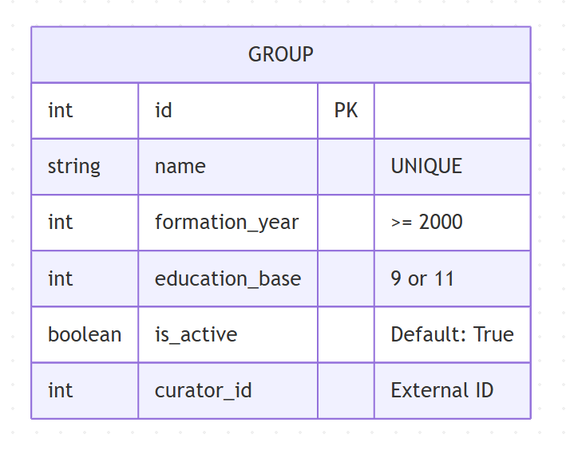

# Вариант №7. Сервис групп (Group Service)

---

## Сущность: Учебная группа (groups)

### Ограничения параметров сущности
1. **name + formation_year**: Составной уникальный ключ. Повторение наименования группы допускается исключительно в разные годы формирования.
2. **formation_year**: Минимально допустимое значение `>= 2000`.
3. **education_base**: Фиксированные значения `9` или `11`.
4. **curator_id**: Запрещено значение `NULL`. При отсутствии куратора устанавливается значение по умолчанию `0`.

---

## Добавить группу
Информация, требуемая для создания учебной группы колледжа. Поле `is_active` при создании сущности во входных параметрах не передается и инициализируется автоматически.

### Входные параметры

| Параметр | Пояснение | Обязательность | Тип | Ограничение | Значение по умолчанию |
| :--- | :--- | :--- | :--- | :--- | :--- |
| name | Название учебной группы | Обязательно | Строка | — | — |
| formation_year | Год набора учебной группы | Обязательно | Целое | `>= 2000` | — |
| education_base | База образования | Обязательно | Целое | `9` или `11` | — |
| curator_id | Идентификатор куратора | Не обязательно | Целое | Запрещен `NULL` | `0` |

### Логика значений по умолчанию (Создание)
* Если во входных параметрах создания параметр `curator_id` не передан, ему автоматически присваивается значение по умолчанию `0`.

### Уникальные комбинации параметров
* **name + formation_year**: Составной уникальный ключ. Повторение наименования группы допускается исключительно в разные годы формирования.

### Выходные данные в случае удачного создания

| Параметр | Тип | Пояснение |
| :--- | :--- | :--- |
| id | Целое | Уникальный идентификатор записи |
| name | Строка | Название учебной группы |
| formation_year | Целое | Год набора учебной группы |
| education_base | Целое | База образования |
| is_active | Логический | Текущий статус группы (возвращается в ответе: `True`) |
| curator_id | Целое | Идентификатор куратора |

---

## Изменить группу по ID
Входные параметры для обновления данных группы. Поля `name` (название) и `formation_year` (год набора) не подлежат изменению в данной операции, поэтому они полностью исключены из входных параметров. Поле `id` также является неизменяемым и служит исключительно для идентификации сущности в базе данных.

**Обоснование бизнес-логики:** Поля `name` и `formation_year` жестко определяют уникальность группы при её создании. Изменение названия или года набора существующей группы нарушит историческую целостность данных, расписания и архивных ведомостей, поэтому данные поля защищены от редактирования. В ответе возвращается вся сущность целиком, чтобы клиент всегда получал актуальное состояние объекта.

### Логика значений при изменении
* Если во входных параметрах изменения параметр `curator_id` не передан, то его текущее значение в базе данных сохраняется и автоматически на `0` не сбрасывается.

### Входные параметры

| Параметр | Пояснение | Обязательность | Тип | Ограничение |
| :--- | :--- | :--- | :--- | :--- |
| id | Идентификатор записи для модификации | Обязательно | Целое | Существует в БД |
| education_base | База образования | Нет | Целое | `9` или `11` |
| is_active | Текущий статус группы | Нет | Логический | — |
| curator_id | Идентификатор куратора | Нет | Целое | Внешний ID (запрещен `NULL`) |

### Выходные данные в случае удачного изменения (Вся сущность целиком)

| Параметр | Тип | Пояснение |
| :--- | :--- | :--- |
| id | Целое | Идентификатор записи (остается прежним) |
| name | Строка | Название учебной группы (остается прежним) |
| formation_year | Целое | Год набора учебной группы (остается прежним) |
| education_base | Целое | Актуальная база образования после изменения |
| is_active | Логический | Актуальный статус активности после изменения |
| curator_id | Целое | Актуальный идентификатор куратора после изменения |

---

## Удаление группы по ID
Фактически запись из БД не удаляется, а реализуется через мягкое удаление — булевое поле `is_active` переводится в состояние `False`.

### Входные параметры

| Параметр | Пояснение | Обязательность | Тип | Ограничение |
| :--- | :--- | :--- | :--- | :--- |
| id | Идентификатор записи для деактивации | Обязательно | Целое | Существует в БД |

### Выходные данные

| Параметр | Тип | Пояснение |
| :--- | :--- | :--- |
| result | Логический | Возвращает `True`, если статус группы успешно изменен на `False`. Возвращает `False`, если группа не найдена или уже была отключена ранее |

---

## Получить группу по ID
Информация, возвращаемая в случае удачного поиска учебной группы по ее идентификатору.

### Выходные данные

| Параметр | Пояснение | Тип |
| :--- | :--- | :--- |
| id | Идентификатор записи в БД | Целое |
| name | Название учебной группы | Строка |
| formation_year | Год набора | Целое |
| education_base | База образования | Целое |
| is_active | Текущий статус группы | Логический |
| curator_id | Идентификатор куратора | Целое |

---

## Получить список групп по заданным параметрам
Информация, требуемая для получения списка учебных групп.

*Примечание: Фильтрация списка групп по параметрам `is_active` (статус активности) и `curator_id` (идентификатор куратора) текущей спецификацией сервиса не поддерживается.*

### Входные параметры

| Параметр | Пояснение | Тип |
| :--- | :--- | :--- |
| formation_year | Фильтрация списка по году набора | Целое |
| education_base | Фильтрация по базе обучения (9 или 11) | Целое |

### Выходные данные (Возвращается в виде списка объектов)

| Параметр | Тип |
| :--- | :--- |
| id | Целое |
| name | Строка |
| formation_year | Целое |
| education_base | Целое |
| is_active | Логический |
| curator_id | Целое |

---

## ER-диаграмма

